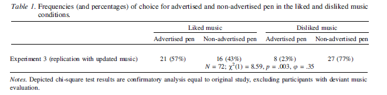

### TABLE OF CONTENTS:
Section | Contents
--------|---------
1       | Synopsis.
2       | Replication of original results & figures.
3       | Extensions.

**1 - Synopsis of report.**
**2 - Replication of original results.**
  2.1 - Table of frequencies.
    2.1.1 - Original table (copy/pasted & abbreviated to only show Study 3 results).
    2.1.2 - Replicated table using R code.
  2.2 - Explanation/description of table results.
  2.3 - Code for replicated table, chi-square analyses and power analyses.
**3 - Extensions.**
  3.1 - Extension (A): Frequency graph.
    3.1.1 - Code for graph.
  3.2 - Extension (B): Moderation analysis by gender.
    3.2.1 - Check of cell sizes for each gender.
    3.2.2 - Code for logistic regression for moderation analysis.

### (1) Synopsis.
This report encompasses the work done to first replicate, and then extend, the findings of Study 3 from Vermeulen et al. (2014). The authors of the original article wanted to know whether single exposure to a certain kind of music (music that is either widely liked or disliked) will condition participants to choose one pen over another. Specifically, they hypothesize that participants exposed to liked music will be conditioned to choose the pen that was advertised while the music is playing; and likewise, participants exposed to disliked music will be conditioned to choose an alternative pen to the one advertised while the music is playing.

Section (2) details our replication process. We reproduce the single figure from the article, a frequency table for the outcome of interest in Study 3 as well as all the chi-square analyses.

Section (3) comprises our two-part extension process. First, we create a bar graph of the frequencies detailed in the original article's table. Second, we statistically test for any moderation of our results by gender, using subsetting the data by gender and then conducting separate logistic regression analyses. From there, we looked for any differences between men and women in the predicted probability of the key outcome variable (pen choice).

### (2.1.1) Original table.


### (2.1.2) Replicated table.
Note: the `echo = FALSE` parameter was added to the below code chunk to prevent printing of the R code that generated the table. See section (2.3) for the full code.

```{r echo = FALSE, warning = FALSE}

# Load packages:
suppressPackageStartupMessages(require(dplyr))
suppressPackageStartupMessages(require(tidyr))
suppressPackageStartupMessages(require(pwr)) 
suppressPackageStartupMessages(require(broom))
suppressPackageStartupMessages(require(lsr))
suppressPackageStartupMessages(require(ggplot2))
suppressPackageStartupMessages(require(MBESS))
suppressPackageStartupMessages(require(psych))
suppressPackageStartupMessages(require(car))
suppressPackageStartupMessages(require(MASS))
suppressPackageStartupMessages(require(stargazer))

# Derrive table of frequencies:
Liked_Music <- c("21(57%)","16(43%)", "N=72, X^2(1)=8.59, p=0.003, phi=0.35")
Disliked_Music <- c("8(23%)","27(77%)", "")
Condition <- c("AdvertisedPen", "NonAdvertisedPen", "Chi-Square")
Freq_Table = cbind(Condition, Liked_Music, Disliked_Music)
stargazer(Freq_Table, type = "text", title = "Study 3: Frequencies of Pen Choice for Each Conditon & Chi-Square")

```

### (2.2) Explanation.
The table above is a reproduction of the frequencies and percentages of subjects' choice for advertised and non-advertised pen in the Liked Music & Disliked Music conditions, respectively, in Study 3. Note that at the bottom of the table is also the chi-square statistic, p-value and effect size (phi) for the data, indicating a medium-sized effect of music condition on pen choice. The table also demonstrates that the frequency of choice in the Disliked Music condition was in the hypothesized direction: Subjects tended to choose the non-advertised pen when made to listen to disliked music in an advertisement. Please note that the data represented above follows the exclusion criteria set forth in the published article. Specifically, any subjects who had participated in a prior version of the study were excluded (two subjects). In addition, 19 subjects were excluded for their so-called "deviant music evaluations". These subjects were foundd to either somewhat dislike the "liked music" (music attiude score below 3) or somewhat like the "disliked music" (music attitude score above 3).

### (2.3) Code for analyses & table.
Note: the 'eval = FALSE' parameter was added to this code chunk to prevent printing of command outputs superfluous to the results reported in the original paper.

```{r}

# Load data
dat <- read.csv("GORN_study3.csv", header = TRUE)
dat <- tbl_df(dat)

# Designate factors:
dat$Groep <- as.factor(dat$Groep)
dat$music <- as.factor(dat$music)
dat$chose_advertised_pen <- as.factor(dat$chose_advertised_pen)

# Filter out 2 excluded participants who accidentily took study twice in the paper:
dat_e <- dat %>%
  filter(excluded == 0)

## Analyses on ENTIRE sample:

# Test whether music condition is independent of pen choice:
# "music"" variable: (1 == liked music, 2 == disliked music)
# "chose_advertised_pen" variable: (0 == not chosen, 1 == chosen)
tbl <- table(dat_e$music, dat_e$chose_advertised_pen)   

# Chi-Square, no correction, no simulation:
cs1 <- chisq.test(tbl, correct = FALSE)
cs1 <- tidy(cs1)

# Power analysis -- Find the power to detect the .35 effect size reported in paper:
pwr.chisq.test(w = .39, N = 91, df = 1, sig.level = 0.05, power = NULL)

# Power analysis -- Find the effect size for a test with .8 sensitivity:
pwr.chisq.test(w = NULL, N = 91, df = 1, sig.level = 0.05, power = .8)
```

Chi-square analyses on the entire sample replicate the results reported in the article and confirm that participants in the liked and disliked music condition did not choose the advertised pen at an equal rate (chi-square = *`r cs1[1,1]`*, *p = `r cs1[1,2]`*).

```{r, eval=FALSE}

## Analyses on SUBSETTED sample:

# Filter out additional 19 Ss with too positive attitudes in "disliked music" condition (reported ratings above 3 in attitudes survey) & too negative attitudes in "liked music" condition (reported ratings below 3):

# Find Cronbach's Alpha for music attitudes scale (for comparison with article):
dat_music <- dat_e %>%
  select(att_muz1, att_muz2, att_muz3)

alpha(dat_music, na.rm = TRUE, delete=TRUE)

# Find mean attitudes for each music condition (for comparison with article): 
dat_e %>%
  group_by(music) %>%
  summarise(avg = mean(c(att_muz1, att_muz2, att_muz3)))

# Check the grand/group-level means (for comparison with article):
dat_e %>%
  group_by(music) %>%
  summarise(avg = mean(avg_att_muz))

```

```{r}

# Exclude participants with average attitude > 3 in disliked condition or average attitude < 3 for liked condition (1 == liked music, 2 == disliked music)

# Add mean attitude column to dataframe:
dat_e <- dat_e %>%
  mutate(avg_att_muz = (att_muz1 + att_muz2 + att_muz3) / 3)

# Create a new dataframe "dat_egood" with filtered participants:
dat_egood <- dat_e %>%
  filter(music == 1 & avg_att_muz > 3 | music == 2 & avg_att_muz < 3)

## Redo Chi-Square with subsetted data:
# Test whether music condition is independent of pen choice:
# Create 2x2 contingency table of frequencies - pen choice by music condition
tbl2 <- table(dat_egood$music, dat_egood$chose_advertised_pen)    

# Chi-Square, no correction, no simulation:
cs2 <- chisq.test(tbl2, correct = FALSE)
cs2 <- tidy(cs2)

# Power analysis -- Find the power to detect .35 effect size reported in paper:
pwr.chisq.test(w = .35, N = 72, df = 1, sig.level = 0.05, power = NULL)

# Power analysis -- Find the effect size for a test with minimum of .8 sensitivity:
pwr.chisq.test(w = NULL, N = 72, df = 1, sig.level = 0.05, power = .8)

# Confidence Intervals (these were not reported in paper, just for curiosity):
#upper (95%)
#CI95_up <- qchisq(.95, df = 1)
#lower (5%)
#CI95_low <- qchisq(.05, df = 1)

```

Chi-square analyses on the subsetted sample replicate from the paper and further confirm that participants in the liked and disliked music condition did not choose the advertised pen at an equal rate (chi-square = *`r cs2[1,1]`*, *p = `r cs2[1,2]`*).

```{r, eval=FALSE}

## Replicate Table: Frequency table & chi-square statistic of subsetted data

# (replicate "Experiment 3" portion of the table from article)

# Generate count and proportion (percent) tallies for replicating the table:
# Amongst those in Liked Music condition:
dat_egoodLike <- dat_egood %>%
  filter(music == 1)
dat_egoodLike %>%
  group_by(chose_advertised_pen) %>%
  summarise(n = n(),
            percent = n / nrow(dat_egoodLike) * 100)

# Amongst those in Disliked Music condition:
dat_egoodDislike <- dat_egood %>%
  filter(music == 2)
dat_egoodDislike %>%
  group_by(chose_advertised_pen) %>%
  summarise(n = n(),
            percent = n / nrow(dat_egoodDislike) * 100)

# Generate table:
Liked_Music <- c("21(57%)","16(43%)", "N=72, X^2(1)=8.59, p=0.003, phi=0.35")
Disliked_Music <- c("8(23%)","27(77%)", "")
Condition <- c("AdvertisedPen", "NonAdvertisedPen", "Chi-Square")
Freq_Table <- cbind(Condition, Liked_Music, Disliked_Music)
stargazer(Freq_Table, type = "text", title = "Study 3: Frequencies of Pen Choice for Each Conditon & Chi-Square")

```

### (3.1) Extension A: Graphing the frequency of responses in each condition.
Note: the parameter "echo = FALSE" was added to this code chunk to prevent the printing of the code. For the code related to this graph, see section (3.1.1).

```{r echo = FALSE}

ggplot(dat_egood, 
       aes(x = music, 
           fill = chose_advertised_pen)) +
  geom_bar(stat = "bin",
           position = position_dodge()) + 
  scale_fill_brewer(name = "Pen Choice", 
                    labels = c("Not Advertised", "Advertised"), 
                    palette = "Set2") +
  ggtitle("Frequency of Pen Choice By Condition") +
  ylab("Frequency") +
  xlab("Music Conditon") +
  scale_x_discrete(breaks = c("1", "2"), 
                   labels = c("Liked", "Disliked")) +
  theme_bw() + 
  theme(axis.title.x = element_text(face = 'bold', size = 15),
        axis.title.y = element_text(face = 'bold', size = 15), 
        plot.title = element_text(face = 'bold', size = 20),
        legend.title = element_text(face = 'bold', size = 12),
        legend.text = element_text(size = 12),
        axis.text.x = element_text(size = 12), 
        axis.text.y = element_text(size = 12))
```

#### (3.1.1) Code for graph.
Note: the "eval = FALSE" parameter was added to prevent the rendering of the figure. To observe the figure, see section (3.1).

```{r eval = FALSE}

# Graph the number of participants who chose each pen, by music condition:
ggplot(dat_egood, 
       aes(x = music, 
           fill = chose_advertised_pen)) +
  geom_bar(stat = "bin",
           position = position_dodge()) + 
  scale_fill_brewer(name = "Pen Choice", 
                    labels = c("Not Advertised", "Advertised"), 
                    palette = "Set2") +
  ggtitle("Frequency of Pen Choice By Condition") +
  ylab("Frequency") +
  xlab("Music Conditon") +
  scale_x_discrete(breaks = c("1", "2"), 
                   labels = c("Liked", "Disliked")) +
  theme_bw() + 
  theme(axis.title.x = element_text(face = 'bold', size = 15),
        axis.title.y = element_text(face = 'bold', size = 15), 
        plot.title = element_text(face = 'bold', size = 20),
        legend.title = element_text(face = 'bold', size = 12),
        legend.text = element_text(size = 12),
        axis.text.x = element_text(size = 12), 
        axis.text.y = element_text(size = 12))

```

### (3.2) Extension B: Investigating the possible moderation of effects by gender, using a logistical regression.

Since the musical stimulus chosen for manipulation in this study was performed by a female artist, it is possible that the strength of aversion to the advertised pen (when paired with a disliked music) would be different by gender. Note: We are quite underpowered to conduct this test as a confirmatory analysis, and there is little theoretical precedent for looking at gender differences in pen choice; thus, this was an entirely exploratory investigation. It is possible that the disliked (and distorted sound) of the female singer's voice impacted women more so than men, such that women had an even greater liklihood of choosing the non-advertised pen when assigned to the disliked-music conditioin. However, as displayed in our analyses of the predicted probabilities below, first for the entire sample, and then for the data subsetted by gender, the likelihood of men and women chosing the advertised or non-advertised pen in each condition is nearly identitical. A greater sampling of men (as well as women) would be needed in order to test this hypothesis with greater statistical power.

#### (3.2.1) A quick check of N by gender in data show a heavy proportion of females were sampled.

```{r echo = FALSE}

#Get counts and check values against article for correct coding scheme:
count(dat_egood, geslacht1)
#confirmed coding scheme:
## 1 = male
## 2 = female

```

#### (3.2.2) Code and analysis results for logistical regressions.

```{r}
# code for the logistic regressions was copy-pasted, then customized to fit the current data, from scripts produced during the class lab sessions (author: Angela R. Dixon)

# Recode dummy variable for music as 0 and 1 for easier interpretation of estimates:
dat_egood$music <- as.numeric(dat_egood$music)
dat_egood <- dat_egood %>%
  mutate(music.recode2 = (music - 1))

#Set factor names:
music_condition <- factor(dat_egood$music.recode2,
                    levels = c(0, 1),
                    labels = c("Liked", "DisLiked"))

pen_choice <- factor(dat_egood$chose_advertised_pen,
                levels = c(1, 0),
                labels = c("ChoseAdPen", "NotChoseAdPen"))

gender <- factor(dat_egood$geslacht1,
                    levels = c(1,2),
                    labels = c("Male", "Female"))

# for relationship between advertised pen and music:
fit1 <- glm(pen_choice ~ music_condition, data = dat_egood, family = binomial)
fit1 <- tidy(fit1)
fit1

#### calculate odds 
fit1$estimate[1] + fit1$estimate[2]

## odds ratio
exp(fit1$estimate[2])

## predicted probabilities:
# Disliked Music:
(exp(fit1$estimate[1] + fit1$estimate[2])) / (1 + exp(fit1$estimate[1] + fit1$estimate[2]))
# Liked Music: 
exp(fit1$estimate[1]) / (1 + exp(fit1$estimate[1])) 

# Does the relationship change when looking ONLY at males & ONLY females?

male.dat_egood <- dat_egood %>%
  filter(geslacht1 == "1")
##double-check correct filtering:
#count(male.dat_egood, geslacht1)

female.dat_egood <- dat_egood %>%
  filter(geslacht1 == "2")
##double-check correct filtering:
#count(female.dat_egood, geslacht1)

# MALES:
fitmale <- glm(pen_choice ~ music_condition, data = male.dat_egood, family=binomial)
fitmale <- tidy(fitmale)
fitmale

#### calculate odds 
fitmale$estimate[1] + fitmale$estimate[2]
## odds ratio
exp(fitmale$estimate[2])

# FEMALES:
fitfemale <- glm(pen_choice ~ music_condition, data = female.dat_egood, family=binomial)
fitfemale <- tidy(fitfemale)
fitfemale

#### calculate odds 
fitfemale$estimate[1] + fitfemale$estimate[2]
## odds ratio
exp(fitfemale$estimate[2])

### predicted probabilities = confirmed, gender does not have a moderating effect on the likelihood 
# of choosing the advertised pen when listening to liked versus disliked music.
# Males - Disliked Music
(exp(fitmale$estimate[1] + fitmale$estimate[2])) / 
  (1 + exp(fitmale$estimate[1] + fitmale$estimate[2])) 
# Males - Liked Music
exp(fitmale$estimate[1]) / (1 + exp(fitmale$estimate[1])) 

# Females - Disliked Music
(exp(fitfemale$estimate[1] + fitfemale$estimate[2])) / 
  (1 + exp(fitfemale$estimate[1] + fitfemale$estimate[2])) 
# Females - Liked Music
exp(fitfemale$estimate[1]) / (1 + exp(fitfemale$estimate[1])) 

```
The predicted probabilities for participants' pen choice in either the liked or disliked conditions did not change after splitting the sample by gender. Males and females were equally likely to choose the same pen, regardless of their assigned condition. However, these results should be qualified by the observation that this data contained over triple the number of female participants as male participants (see section 3.2.1).